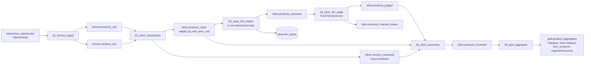

# Nimble Gravity — Data Engineering Challenge 2026

End-to-end **Medallion Architecture** pipeline on **Databricks Free Edition** for
the electronics dataset, with an **LLM extractor + LLM-as-Judge** validation
loop.

---

## Architecture



## Repository layout

```
.
├── databricks.yml                # Asset Bundle entry point
├── resources/jobs/pipeline.yml   # Job DAG (one task per Medallion stage)
├── notebooks/                    # Databricks notebooks (.py source format)
│   ├── 00_run_pipeline.py        # Orchestrator (sequential runner)
│   ├── 01_bronze_ingest.py
│   ├── 02_silver_standardize.py
│   ├── 03_silver_llm_extract.py
│   ├── 04_silver_llm_judge.py
│   ├── 05_silver_taxonomy.py
│   └── 06_gold_aggregate.py
├── src/nimble_pipeline/          # Reusable, unit-testable Python package
│   ├── parsers/                  # weight, price, vendor (pure Python)
│   ├── llm/                      # client, extract, judge
│   └── config.py                 # catalog/schema/table constants
├── prompts/                      # Versioned LLM prompts (YAML)
│   ├── extract_v1.yaml
│   └── judge_v1.yaml
├── tests/                        # pytest unit tests for parsers
├── docs/                         # Source PDF + xlsx
└── pyproject.toml
```

## Key design decisions

### 1. Medallion layers map cleanly to the source spec

| Stage | Layer | Notebook |
|---|---|---|
| Ingest | Bronze | `01_bronze_ingest` |
| Standardize | Silver | `02_silver_standardize` |
| LLM Extraction | Silver | `03_silver_llm_extract` |
| LLM Judge | Silver | `04_silver_llm_judge` |
| Taxonomy enrichment | Silver | `05_silver_taxonomy` |
| Aggregation | Gold | `06_gold_aggregate` |

### 2. Deterministic parsers live in `src/`, not in notebooks

`weight`, `price` and `vendor` parsers are pure-Python functions with full
`pytest` coverage over **all 30 real rows of the dataset**. The Spark layer
wraps them as UDFs, so we keep one source of truth and gain CI-friendly tests.

### 3. Vendor deduping is fuzzy + deterministic, not LLM-based

`rapidfuzz.WRatio ≥ 85` clusters variants like `ASUSTeK Computer Inc.` and
`Asus tek` into one canonical `vendor_id`. This is auditable, cheap and
reproducible — three properties LLMs don't give you for free.

### 4. The Judge has a **wider** taxonomy than the extractor — by design

| | Sub-categories visible to the prompt |
|---|---|
| Extractor | 5: Televisions, Computers, **Accessories**, Phones, Smartwatches |
| Judge | 9: + Printers, Cameras, Consoles, Hardware |

This is the core challenge of the exercise: the extractor is *forced* to
mis-label printers/cameras/consoles as "Accessories"; the Judge — equipped
with the broader taxonomy — flags them and routes them to manual review.

### 5. Idempotency at every layer

* Bronze and Silver tables: `MERGE` on a stable key (`product_id`).
* Gold: deterministic over Silver state, written with `overwriteSchema`.
* LLM calls: `silver.llm_cache` keyed on `(description_hash, prompt_fingerprint)`
  so re-runs only call the LLM for new/changed rows.

### 6. Schema evolution

All Bronze + Silver writes use `mergeSchema=true`. New columns added upstream
(or by a future prompt version) flow through without manual DDL.

### 7. LLM provider: Databricks Foundation Model APIs (demo) — Anthropic Claude (recommended for production)

**Demo implementation**: the workspace's built-in Foundation Models, default
`databricks-meta-llama-3-3-70b-instruct`, via the OpenAI-compatible endpoint.
**No external secret needed** on Databricks Free Edition — the notebook context
provides `DATABRICKS_HOST` / `DATABRICKS_TOKEN`.

**Recommendation for production: Anthropic Claude** (Sonnet 4.6 / Haiku 4.5).
The `LLMClient` already supports any OpenAI-compatible endpoint, so swapping
provider is one env var (`OPENAI_API_KEY` or a Bedrock/Anthropic gateway URL).
Why Anthropic for production:

* **Structured output / JSON mode is more reliable** at low temperature, which
  matters when the extractor must commit to one of N enum values.
* **Native, robust tool use** for typed extraction — fewer parser fallbacks.
* **Better instruction following** with hard constraints
  ("pick exactly one from this list of 5") — relevant for the restricted
  sub-category prompt.
* **Cost/latency**: Haiku 4.5 is competitive for high-volume taxonomy work and
  Sonnet 4.6 covers the Judge cleanly.

### 8. MLflow traceability for every LLM call

Each call logs:

* `prompt_name`, `prompt_version`, full prompt body (system + template) as artifact
* `model`, `latency_ms`, token counts (when provided by the endpoint)
* Parsed result and verdicts

### 9. Prompt versioning

Prompts live in `prompts/*.yaml` with `name` + `version`. Their fingerprint
(`extract_v1`, `judge_v1`) is part of the LLM cache key, so changing a prompt
forces a fresh call without manual cache invalidation.

### 10. `Category` is a documented mapping, not an LLM output

The source brief mentions both `Category` and `Sub-Category` in the Gold table
but only Sub-Category is extracted by the LLM. We chose a deterministic rollup:

| Sub-Category | Category |
|---|---|
| Televisions, Phones, Smartwatches, Cameras, Consoles | Consumer Electronics |
| Computers, Printers, Hardware | Computing |
| Accessories | Accessories |

(See `src/nimble_pipeline/config.py::SUB_CATEGORY_TO_CATEGORY`.)

**Why deterministic and not LLM-extracted?**

* Auditability — the rule is reviewable and unit-testable.
* Idempotency + cost — re-runs do not require an extra LLM call.
* The source brief lists only `Name, Sub-Category, Brand` as LLM outputs.

**Future extension**: the extractor prompt could be widened to produce
`Category` in the same call, dropping the rollup table. That's a valid
trade-off (one fewer table vs. one extra failure mode in the LLM contract);
we kept the deterministic version for the demo because it's clearer to
defend in a walkthrough.

### 11. Why we did **not** use DLT / Lakeflow SDP

Delta Live Tables (rebranded **Lakeflow Spark Declarative Pipelines (SDP)**
on January 23, 2026) is available on Free Edition, but with a **1-active-pipeline**
limit per pipeline type. We chose plain Delta + explicit `MERGE`:

* The 1-pipeline limit doesn't fit a 6-stage Medallion DAG.
* Explicit `MERGE` makes idempotency observable in the demo, where DLT would
  abstract it away.
* `Asset Bundles + Jobs Workflow` give the same DAG-level observability with
  finer task control.
* DLT-style expectations are simulated with programmatic DQ checks in Silver
  Standardize — the same outcome for evaluation purposes.

## How to run

### On Databricks Free Edition (the way the challenge will be evaluated)

1. Sign up for [Databricks Free Edition](https://www.databricks.com/learn/free-edition).
2. Clone this repo into your workspace (`Repos → Add Repo`).
3. Upload `docs/electronics_dataset.xlsx` to a Volume:
   `/Volumes/nimble_challenge/raw/files/electronics_dataset.xlsx`.
4. Open `notebooks/00_run_pipeline.py` and run all cells, or deploy via
   Asset Bundles:

   ```bash
   databricks bundle deploy --target dev
   databricks bundle run nimble_pipeline --target dev
   ```

### Locally (parser unit tests only)

```bash
python3.13 -m venv .venv
source .venv/bin/activate
pip install -e ".[dev]"
pytest
```

## Bonus checklist

| Bonus | Status | Where |
|---|---|---|
| Version Control & CI/CD | ✅ | `.github/workflows/ci.yml` (lint + pytest) |
| Databricks Asset Bundles | ✅ | `databricks.yml` + `resources/jobs/pipeline.yml` |
| Data Quality Expectations | ✅ | DQ checks in `02_silver_standardize` |
| MLflow Traceability | ✅ | `03_silver_llm_extract`, `04_silver_llm_judge` |
| Idempotency | ✅ | `MERGE` on every layer + LLM cache |
| Prompt Versioning | ✅ | `prompts/*.yaml` with `name`+`version`, used as cache key |

## Trade-offs and known gaps

* **Driver-side LLM loop**. With 30 rows it's simpler and cheaper than a
  pandas UDF. For thousands of rows, switch to `mapInPandas` + an async client.
* **Single prompt version per run**. A/B testing prompts would require a
  side-by-side `prompt_fingerprint` column in the cache; out of scope here.
* **No retry logic on LLM transient errors**. The platform endpoint is
  generally reliable; for production, wrap the client in `tenacity`.
